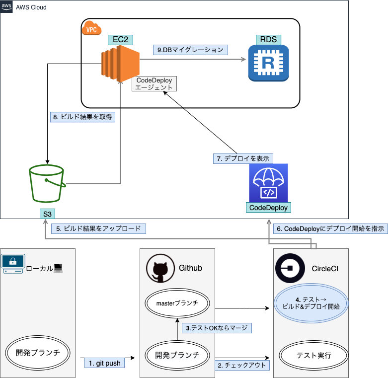

# MINDFULNESS

### ポートフォリオNo.1

### ポートフォリオNo.2

 

## 【概要】

 

## 【使用技術】
### ポートフォリオNo.1(メイン)
- PHP 7.3.11
- Larval 6.18.40 
- Javascript
- Vue.js
- ajax(非同期処理)
- AWS( EC2 / RDS(postgres) / S3 / VPC / CodeDeploy / CloudFortation / Route53 / AWS-CLI )
- CircleCI(自動テスト、自動ビルド)
- CodeDeploy(自動デプロイ)
- CI/CD( CircleCI/ CodeDeploy )
- Laradock(開発環境)
- SCSS
- MDBootstrap
- Bootstrap
- PHPUnitテスト 

### ポートフォリオNo.2
- PHP 7.3.11
- Javascript
- HTML
- CSS
- Bootstrap
- Eclipse(IDE)
- Mysql
- Apache
- さくらインターネット（メール通知機能、デプロイ）
 

## 【機能一覧】
### ポートフォリオNo.1
- 自作新規会員登録機能
- 自作ログイン機能
- いいね機能（非同期通信 Vue.js+axios）
- コメント投稿機能 コメント編集機能 コメント削除機能
- ページネーション機能
- 画像投稿機能（Cloudinary 外部API）
- 投稿詳細画面
- 新規投稿機能、投稿一覧機能、投稿編集機能、投稿削除機能(CRUD機能)
- 簡単ログイン機能
- 管理者簡単ログイン機能
- 管理者権限機能
- 管理者 ユーザー一覧機能
- 管理者 ユーザー削除機能
- バリデーション日本語化（新規登録、ログイン、新規投稿、投稿更新、コメント投稿）
- テスト複数記述

### ポートフォリオNo.2
- 新規会員登録機能
- ログイン、ログアウト機能
- ログイン新規登録チェック機能
- トップページ、サービス詳細画面
- 毎日メール通知機能（さくらインターネットのcronサービスを使用）
- 週に１度のメール通知機能（さくらインターネットのcronサービスを使用）
- 新規投稿機能、投稿一覧機能、投稿編集機能、投稿削除機能（CRUD）
- 自動ログイン機能（Cookieを使用）
- レスポンシブデザイン対応(スマホ対応)
- 自作CSRF対策（sha関数使用）
- session管理 Cookie使用
- 複数共通ファンクションの作成 (config.phpファイルにまとめてある)
- 簡単ログイン機能
 

## 【インフラ構成図】

  

## 【ワイヤーフレーム】

## 【制作理由】
 
 &nbsp; 

 **私は約２年間毎日瞑想を続けています**。その中で私の人生は良い方向に大きく変化していきました。そこで一人でも多くの方の生活習慣に瞑想を取り入れてもらい、人生を変える「きっかけ」や「気付き」を提供したく、このサービスを制作するまでに至りました。 &nbsp; また最近ではコロナの影響もあり、これから精神疾患患者数が増えていくと言われる世の中です。そんな時代を生き抜く為には自分でメンタルケアできるスキルは必須と言えます。そのスキルを習得する事においてマインドフルネス瞑想は最適なツールとなり得ます。是非一人でも多くの方がマインドフルネス瞑想によって自身の人生をより良いものに変化していくことを心から願っております。そのきっかけがこのサービスなら私にとってこの上ない幸せであります。
 

## 【アピールポイント】
- **CI/CD(自動テスト自動デプロイ)という業務の効率化を図る上で必須と言われる技術に興味があり**ポートフォリオに実装して理解を深めました。 
- **全て独学で制作しています**。ポートフォリオ２に関しては「ブラックボックス化を防ぐ事」と「基礎固め」をする為に**全てPHP**でコードを記述しています。 
- 豊富な機能を実装しています。**数にすると合計で33個の機能を実装しています**。 
- アプリケーションブラウザテストまで行っています。下にスプレッドシートのURLが貼ってあるのでお手隙の際ご覧いただけると幸いです。 
- 今後はさらに実際の開発現場を意識して**Dockerの学習を行い、開発環境に取り入れていくつもりです。**。
 

## 【アプリケーションブラウザテスト（Chrome/Firefox/safari/Edge/IE 11,10,9,8）】
[スプレッドシート](https://docs.google.com/spreadsheets/d/1VHTu-UZnbfKLE30rUPOp0xKJSU-AV2oquUGVsC01C44/edit?usp=sharing)
 

## 【学習記録】
- 主に技術系のアウトプットを行っています。
[Qiita](https://qiita.com/YUYU070703)
- 毎日の学習記録を継続して投稿しています。
[Twitter](https://twitter.com/mindfulness0707)
